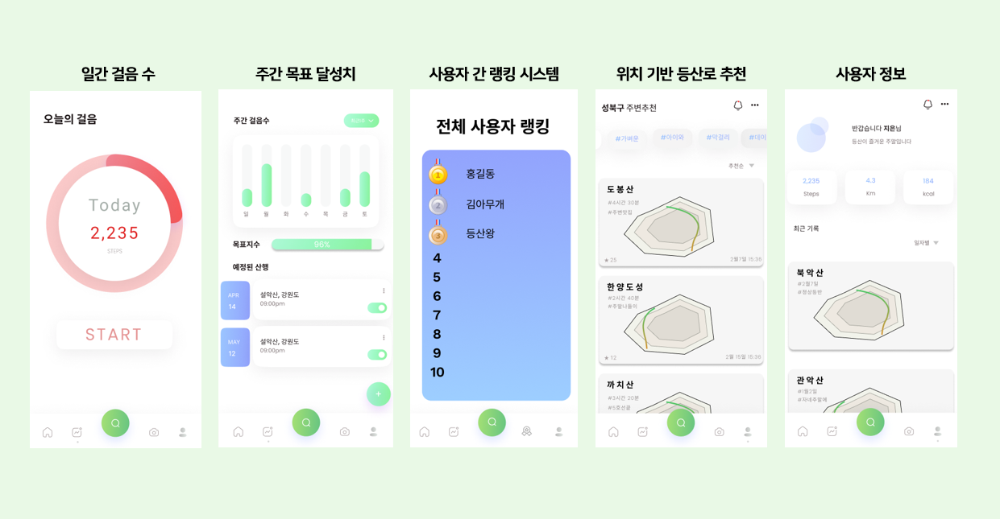

<h1>산Check - 등산의 즐거움</h1>

  

**Github Link** : https://github.com/kookmin-sw/capstone-2022-42  
**Github Page Link** : https://kookmin-sw.github.io/capstone-2022-42

**중간발표자료** : https://github.com/kookmin-sw/capstone-2022-42/blob/76e4f7fe45beecb0517d2ff329bc6a583b9c6b13/docs/%ED%8C%8042-%EC%A4%91%EA%B0%84%EB%B0%9C%ED%91%9C%EC%9E%90%EB%A3%8C.pdf

**소개동영상 링크**: https://youtu.be/IN6e0nv74rw

<h2>✔️ 프로젝트 소개</h2> 
코로나19로 인한 답답한 일상 속에서 새로운 여가 활동을, 잃어버린 건강을 찾고자 하는 사람들의 증가는 <b>등산 인구의 증가</b>를 불러일으켰다. 뿐만 아니라 등산은 오래전부터 남녀노소 상관없이 즐길 수 있는 여가 활동으로 자리 잡고 있다. 
본 프로젝트에서는 걸음 수를 기록할 수 있는 만보기, 주간 목표 설정, 사용자 간 랭킹 시스템, 다양한 기준에 따른 등산로 추천을 제공하여 기존에 등산을 즐겨 하는 사람들에게 더 즐거운 등산을 장려하고, 더 나아가 기존에 등산을 즐겨 하지 않는 사람들 또한 등산에 흥미를 붙여 등산의 즐거움을 알게 해주고자 한다.
<br>
<h3>산Check 효과</h3> 
🔸 본 어플리케이션이 제공하는 만보기와 주간 목표 설정 기능으로 하여금 본 어플리케이션을 등산을 위한 어플리케이션으로써의 활용 뿐만 아니라 헬스케어 어플리케이션으로써의 활용 또한 기대할 수 있다.  

🔸 본 어플리케이션이 제공하는 다수의 등산로와 등산로 별 부여된 길이, 소요 시간, 난이도를 통해 가벼운 운동부터 정상 등반까지 사용자가 상황에 맞는 적합한 선택을 할 수 있도록 돕는다.  
🔸 일일 미션 완료, 등산로 완주 후에 얻을 수 있는 점수로 매기는 사용자 간 랭크는 사용자 간의 경쟁 심리, 보상 심리를 자극해 잦은 등산을 유도하며 이는 곧 등산이 사용자의 건강을 가꾸는 수단이 됨을 기대할 수 있다.

<h2>✔️ Abstract</h2>  
The increase in the number of people seeking new leisure activities and lost health in the frustrating daily life caused by COVID-19 has caused an <b>increase in the mountaineering population</b>. In addition, hiking has long been a leisure activity that can be enjoyed regardless of age or gender.   
In this project, we will provide pedometers to record the number of steps, weekly goal setting, user-to-user ranking system, and various criteria to encourage hikers to enjoy hiking, and those who do not enjoy hiking will also be interested in hiking.
<br>
<h3>SanCheck Effects</h3>
🔸 You can expect the pedometer and weekly goal setting function provided by this application not only to use this application as an application for mountain climbing but also to use it as a healthcare application.

🔸 Through the length, time required, and difficulty assigned to each hiking trail and hiking trail provided by this application, it helps users make appropriate choices from light exercise to normal climbing.  
🔸 Ranks among users based on the score that can be obtained after completing the daily mission and completing the hiking trail stimulate competition among users and reward psychology, which can be expected to be a means of improving users' health.


<h2>✔️ 어플리케이션 기능 소개</h2>
  
  

<h3>🚶 일간 걸음 수</h3>
🔸 사용자의 일간 걸음 수를 기록하는 만보기 기능을 제공한다.
<h3>📑 주간 목표 달성치</h3>
🔸 사용자의 주간 걸음 수를 시각화하여 요일별 사용자의 걸음 수를 나타낸다.

🔸 사용자가 지정한 목표 걸음 수 달성도, 일일 미션 달성도 등을 수치화하여 나타낸다.     
🔸 사용자가 계획한 등산 일정을 한 눈에 보기 쉽게 나타낸다.
<h3>👍 사용자 간 랭킹 시스템</h3>
🔸 등산로 완주 횟수, 완주한 등산로 난이도와 같은 기준에 의거하여 부여된 점수를 바탕으로 사용자 간 랭크를 매긴다. 

🔸 랭크를 매겨 사용자 간의 경쟁 심리를 자극해 잦은 등산을 유도해 사용자의 건강한 여가 생활을 장려한다.
<h3>⛰️ 위치 기반 등산로 추천</h3>
🔸 사용자의 현재 위치, 특정한 위치 등을 기반으로 주변의 등산로를 찾아 추천한다.   

🔸 등산로 별 난이도를 기반으로 사용자에게 알맞은 등산로를 추천한다.   
🔸 산 이름, 등산로 이름, 난이도, 상하행 시간, 등산로 길이를 제공한다.
<h3>ℹ️ 사용자 정보</h3>
🔸 사용자의 일일 걸음 수, 거리 등을 알려준다.  

🔸 사용자가 최근에 완주한 등산로를 기록한다.

  
<h2>✔️ 팀 소개</h2>  

```  
📛 이름: 박유영
🔖 학번: ****1597
✉️ 메일: dbduda1@kookmin.ac.kr
📌 역할: 팀장, Back-End 개발(사용자 정보 관리, 만보기 구현)
```  
```
📛 이름: 김정민
🔖 학번: ****0883
✉️ 메일: jess654852@kookmin.ac.kr
📌 역할: Back-End 개발(일일 미션, 사용자 간 순위, 보상 및 점수 시스템 구현)
```
```
📛 이름: 송용욱
🔖 학번: ****0711
✉️ 메일: songyonguk@kookmin.ac.kr
📌 역할: Front-End 개발
```
```
📛 이름: 안현섭
🔖 학번: ****5166
✉️ 메일: abo3323@kookmin.ac.kr
📌 역할: Front-End 개발
```
```
📛 이름: 이정훈
🔖 학번: ****1678
✉️ 메일: yellowoov@kookmin.ac.kr
📌 역할: Back-End 개발(등산로 추천 시스템, 커뮤니티 구현)
```
<h2>✔️ 사용법</h2>  
